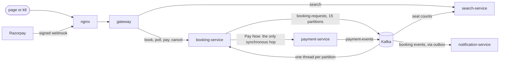

# MiddleBerth

A tatkal train-booking backend built as **five Spring Boot microservices** around Kafka,
PostgreSQL and Redis, to prove one thing under load: **no berth is ever given to two
people.**

Indian Railways opens a small quota of seats at 10:00 AM the day before travel, and
lakhs of people click in the same second. MiddleBerth is named after the worst berth
on the train: the one you get when you lose that race.

[](https://github.com/samartiwari/MiddleBerth/actions/workflows/tests.yml)

**Live demo:** [middleberth.samartiwari.me](https://middleberth.samartiwari.me). Sign up,
book a real berth, pay with a Razorpay test card, and watch every API call the page makes
([frontend code](https://github.com/samartiwari/MiddleBerth-Frontend)). The API behind it is
`api.middleberth.samartiwari.me`, on a small 2 vCPU server for trying it out, which is not
where the numbers below come from.

---

## The numbers

Measured on one laptop (AMD Ryzen 7 7435HS, 8 cores / 16 threads, 23 GB RAM) running
all 13 containers **and** the k6 load generator. Payments stubbed, mail logged.

**Steady load.** People keep arriving at a fixed rate for a full minute, across 300
trains and 172,800 berths:

| arrivals a second | keeps up | decided a second | click to answer, p95 | CPU | double bookings |
|---|---|---|---|---|---|
| 500 | yes | 500 | 0.51 s | 38% | 0 |
| **1,000** | **yes** | **1,000** | **0.52 s, flat for the minute** | 65% | **0** |
| 1,500 | no | 850 | climbing | 99% | 0 |
| 2,000 | no | 962 | climbing | 99% | 0 |

"Answer" means the page seeing HELD or WAITLISTED. It cannot be much under half a second,
because that is when the page first asks. Past 1,000 a second the laptop's CPU is full,
and throughput levels off near 900 rather than collapsing.

**The tatkal spike.** 4,000 people click at once for 480 berths: exactly 480 held,
exactly 480 waitlisted, the other 3,040 told no (many of them at the door, in a single
read), and **zero double bookings**. All 4,000 booking requests were answered within
about two seconds.

Every load run ends by checking the database itself: no berth held by two people, no
berth marked taken with nobody holding it, no waitlist number handed out twice.

**For scale.** Indian Railways' reservation system handles
[about 32,000 tickets a minute](https://www.pib.gov.in/PressReleasePage.aspx?PRID=2140614&reg=48&lang=2),
roughly 530 a second. IRCTC's record is
[37,410 tickets in one minute](https://www.newkerala.com/news/a/irctc-sets-new-records-online-ticket-booking-blocks-942.htm),
at 10:02 AM on 16 August 2025, and the reservation system replacing today's is designed
for over 1.5 lakh a minute. MiddleBerth held **1,000 berths a second, 60,000 a minute, on one laptop.**

That is not a like-for-like comparison, and not a claim to be faster than IRCTC. Their
count is paid tickets from real people through real banks, across the whole railway and
alongside lakhs of enquiries a minute. This one is berths held with payment stubbed and
k6 playing the passengers. What it does show is that the heart of the problem, taking a
flood of requests and handing out berths without ever giving one to two people, keeps
pace with more than IRCTC's record rate on a single machine.

## What measuring it found

Each of these came out of a load test rather than a code review, and each is a commit
with its own before and after.

1. **One thread was doing all the booking.** Spring Kafka's listener concurrency
   defaults to one and had never been set, so fifteen partitions fed a single thread.
   With fifteen, the last person's wait in a 4,000-person rush went from 9.2 s to 1.8 s.
2. **The gateway was queueing on a lock inside a library.** Thread dumps caught 13 of
   its 16 worker threads parked in Spring Data Redis, which checked on every
   rate-limited request whether a Lua script inside a jar had changed. Loading the
   script once made the average booking 17% faster and logins 30% faster.
3. **A throwaway session on every request.** Spring Security's defaults created a web
   session for each request to a token API. Turning that off made logins another 40%
   faster and the slowest bookings 25% faster.
4. **nginx ran out of ports.** With only 64 reusable connections to the gateway,
   overload made it open and close connections until about 28,000 local ports were
   waiting out their minute, and it answered 104,000 requests with an instant 502.
   Keeping 1,024: zero errors.
5. **Polling became most of the traffic.** Waiting pages asked every half second, and
   every ask about an undecided booking queried Postgres. Now the server says when to
   ask again (half a second, growing to four) and pending asks are answered from Redis.
   Past the limit: 5 polls per booking instead of 13 to 15.
6. **The claim query walked the whole table.** `ORDER BY id LIMIT 1` over an index
   without `id` let Postgres walk the primary key instead: 172,512 rows read to claim
   one berth on the last train. The same code at 1,000 a second kept up in one run and
   collapsed to 196 in the next. With `id` added to the index a claim reads 5 pages,
   and 1,000 a second holds.

## How a booking works



Each service owns its own Postgres. Redis holds the per-user rate limits, the search
cache and the answers waiting pages poll for.

1. **Book.** The gateway checks the JWT and the per-user rate limit. booking-service does
   three indexed reads at the door (the train exists, the date is on sale, the waitlist
   is not full), notes the request as pending, puts it on Kafka keyed by train, date and
   class, and replies **202** once the broker has it: about 10 ms at p95 under load.
2. **Claim.** A booking thread runs `SELECT ... FOR UPDATE SKIP LOCKED`, so claims on
   the same train step over each other's locked rows instead of queueing behind them.
   If no berth is free, an atomic counter hands out a waitlist position; past the cap
   the answer is "regretted". A duplicate request is stopped by a
   `UNIQUE (user_id, request_id)` constraint, not by checking first.
3. **Poll.** The page asks `GET /api/bookings/{requestId}`. The booking thread has left
   the answer in Redis; while it is pending, the reply says when to ask again.
4. **Pay.** A held berth is kept for 5 minutes, plus a minute of cushion, plus three
   more if a payment is in progress. Razorpay's signed webhook confirms it, and a
   reconciliation job asks Razorpay about any order whose webhook never arrived. Money
   that arrives late is judged by when it was paid, not when it was noticed. A berth
   that is released goes to the next paid waitlister inside the same transaction.
5. **Cancel.** The fare is refunded. The 3% convenience fee is what covers Razorpay's
   2.36% cut, which Razorpay never gives back.

## Why microservices

Five services, each with its own database, each built, deployed and scaled on its own.
They talk over HTTP where the answer is instant and over Kafka everywhere else. The only
call between services that anybody waits on is booking asking payment for an order.

| service | owns |
|---|---|
| gateway | login, tokens, per-user rate limits, routing; the only way in |
| search-service | trains and availability, read-heavy, answered from Redis |
| booking-service | intake, berth claiming, holds, the waitlist, a booking's whole life |
| payment-service | Razorpay orders, signed webhooks, refunds, reconciliation |
| notification-service | mail |

Where the lines are drawn, and why:

- **Search and booking are apart** because their loads are opposite. Browsing is reads
  that must stay fast while booking is on fire; booking is writes and row locks. They
  need different amounts of machine, and neither shares threads or a database with the
  other.
- **Payment is apart** so payment keys, webhook signatures and refunds never live in the
  service that holds berths.
- **Mail is apart** so a slow or broken mail server can never hold up a booking.
- **Berths stay inside booking-service,** so locking a berth is never a network call at
  the busiest moment of the day. booking-service owns the whole process too, so "what
  happened to booking 1234?" is one query, not a story spread across three services.
- **No user service, config server or service registry.** Login lives at the gateway,
  and Docker Compose and Kubernetes already name and find the services.

Honestly, at this project's traffic one Spring Boot application could do the job, and
microservices mostly exist so that separate teams can deploy separately. The split here
follows the load and the risk, not a checklist.

## Run it

Needs Docker, nothing else.

```bash
git clone https://github.com/samartiwari/MiddleBerth.git
cd MiddleBerth
docker compose up -d --build     # 13 containers; the first build takes a few minutes
bash deploy/smoke.sh             # token, search, book, poll, pay, webhook, confirmed
```

The defaults are safe for a laptop: payments stubbed, mail written to the log, demo
tokens on. It listens on port 80; if that is taken, start it with
`HTTP_PORT=8089 docker compose up -d` and run `bash deploy/smoke.sh http://localhost:8089`.

By hand, with a demo token (needs `jq`):

```bash
TOKEN=$(curl -s -X POST localhost/auth/token -H 'Content-Type: application/json' \
          -d '{"userId":5512}' | jq -r .token)
DATE=$(date -u -d tomorrow +%F)

curl -s "localhost/api/trains/12951/availability?date=$DATE&class=3A"

curl -s -X POST localhost/api/bookings \
  -H "Authorization: Bearer $TOKEN" -H 'Content-Type: application/json' \
  -d "{\"requestId\":\"A7X2\",\"trainNumber\":\"12951\",\"travelDate\":\"$DATE\",\"coachClass\":\"3A\",
       \"passenger\":{\"name\":\"Asha\",\"email\":\"asha@example.com\",\"phone\":\"9876543210\"}}"

curl -s localhost/api/bookings/A7X2 -H "Authorization: Bearer $TOKEN"
```

| endpoint | what it does |
|---|---|
| `POST /auth/signup`, `POST /auth/login` | real accounts, BCrypt; failed logins limited per account |
| `POST /auth/token` | demo token for any user id, only when `AUTH_DEMO_TOKENS=true` |
| `GET /api/trains`, `GET /api/trains/{number}/availability` | browsing, no login |
| `POST /api/bookings` | book: 202 and a request id |
| `GET /api/bookings/{requestId}` | the answer, or PENDING with `retryAfterMs` |
| `POST /api/bookings/{requestId}/pay` | a Razorpay order for a held berth |
| `POST /api/bookings/{requestId}/cancel` | give it up; the berth goes down the waitlist |
| `GET/POST/DELETE /api/passengers` | the saved passenger list |
| `POST /webhooks/razorpay` | payment confirmation, checked against its signature |

## Load tests

k6 runs from its Docker image, so there is nothing to install. Every run resets the data
first and checks the database for double bookings last, and refuses to start if payments
are live or mail is real.

```bash
BROWSE=0 bash loadtest/run.sh 4000             # the spike: 4,000 people at once
bash loadtest/steady.sh 500 1000 1500 2000     # steady rates, one row per rate
bash loadtest/ladder.sh 1000 2000 3000 4000    # bigger and bigger spikes
```

## Tests

170 tests, all against real Postgres, Kafka and Redis through Testcontainers.
Never H2, which does not implement `FOR UPDATE SKIP LOCKED` the way Postgres does, so
tests would pass while the real thing was broken.

The one the project exists for releases 500 threads at once against 24 berths: exactly
24 held, 24 different berths. Another runs the real claim query against 300 trains of
berths and fails if Postgres reads a single row that belongs to another train.

GitHub Actions runs every service's suite, then starts the whole system and books a
ticket through it.

```bash
cd booking-service && ./mvnw test     # Java 21, with Docker running
```

## Deliberate choices

- **Booking is asynchronous.** The web request only queues. A synchronous claim would
  hold a thread and a database connection for every person waiting, and a rush would
  exhaust the pool in its first second, turning away even the people who should have
  heard "no" instantly.
- **The berth is held before payment,** so nobody pays and then finds out it was gone.
- **Released berths go down the waitlist in order,** not back into a free-for-all.
- **The database is the referee.** Double bookings and duplicates are prevented by row
  locks and constraints, never by check-then-act.
- **Kafka is keyed on train, date and class.** One train's requests are handled in the
  order they arrived; different trains are handled in parallel.
- **Mail goes through an outbox** written in the booking's own transaction. Seat counts
  are announced after commit and repaired by a periodic snapshot.
- **Nothing is dropped.** Every listener retries with growing gaps, then parks the
  message on a dead-letter topic that is counted and alerted on.
- **Rate limits are per user, not per IP,** so a college hostel behind one address is
  not treated as one person.

## What is not real

- Payments are stubbed in tests and load tests. Razorpay test mode works end to end
  (`deploy/live-payment.sh`), and [`deploy/going-live.md`](deploy/going-live.md) lists
  what changes for a real deployment.
- Load tests log in through the demo token endpoint, because hashing thousands of
  passwords would measure BCrypt rather than booking.
- There is no frontend; k6 plays the page.
- One Kafka broker and one copy of each service. Kubernetes manifests with an autoscaler
  are in `k8s/` (`k8s/up.sh` builds a kind cluster), but on one laptop the cluster was
  slower than plain compose: Kubernetes pays off across machines, not on one.
- The numbers come from a laptop with the load generator on it. They show where the
  design breaks and what fixed it, not what a data centre would do.

## Layout

```
gateway/               JWT, per-user rate limiting, routing (Spring Cloud Gateway)
booking-service/       intake, berth claiming, holds, waitlist, payments, outbox
search-service/        trains and availability, fed by seat-count events
payment-service/       Razorpay orders, signed webhooks, refunds, reconciliation
notification-service/  mail, behind a Notifier interface
contracts/             JSON schemas of the Kafka events
deploy/                nginx, seed data, smoke test, going-live notes
loadtest/              k6: spike, steady rate, ladder
k8s/                   kind cluster, manifests, autoscaler
```

Java 21 · Spring Boot 3.5 · Microservices · Spring Cloud Gateway · Kafka 3.8 ·
PostgreSQL 16 · Redis 7 · nginx · k6 · Testcontainers · Docker Compose · Kubernetes
